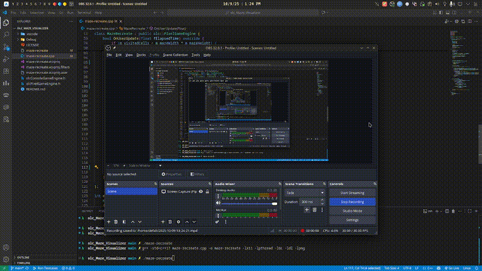

# olc-Maze-Visualizer 🧩
A visually animated **maze generation algorithm** built with the **olcPixelGameEngine** (by [javidx9](https://github.com/OneLoneCoder)) — rewritten from scratch in C++ for cross-platform environments such as **EndeavourOS (Linux)**, **Windows**, and **macOS**.

---

## 🎯 Overview
This project recreates the classic *Recursive Backtracker Maze Generation* algorithm popularized by **javidx9** on YouTube — but adapted for graphical visualization using the **Pixel Game Engine (PGE)** instead of the old Windows console.

The maze is generated in real-time, showing the carving process cell by cell with smooth animation.

---

## 🖼️ Demo


---

## ✨ Features
- 🧱 **Depth-First Search (Backtracker)** maze generation  
- 🎨 **Animated visualization** using `olcPixelGameEngine`  
- 🔁 **Press `R` to regenerate** a new maze instantly  
- ⌨️ **Press `ESC` to exit** the program  
- ⚙️ **Platform-independent** (works on Linux, Windows, macOS)  
- 🧩 Written in modern **C++17**

---

## 🧠 Algorithm Summary
The maze is built using the **Recursive Backtracker** method:

1. Start at the initial cell (0,0).  
2. Mark it as visited.  
3. Choose a random unvisited neighbor and carve a passage.  
4. Push the current cell onto a stack and move to the chosen neighbor.  
5. When no unvisited neighbors remain, backtrack until a cell with available neighbors is found.  
6. Continue until all cells have been visited.

This results in a *perfect maze* — one unique path between any two cells.

---

## ⚙️ Build Instructions

### 🔧 Prerequisites
Make sure you have:
- A C++17 compiler (e.g. `g++`, `clang++`, or MSVC)
- [olcPixelGameEngine.h](https://github.com/OneLoneCoder/olcPixelGameEngine) in your project directory
- On Linux, install required dependencies:

  ```bash
  sudo pacman -S base-devel libpng mesa glu
  ```

### 🏗️ Build Command
Compile with:
```bash
g++ -std=c++17 maze-recreate.cpp -o maze-recreate -lX11 -lpthread -lGL -ldl -lpng
```
Then run:
```bash
./maze-recreate
```

## 🎮 Controls
| Key     | Action                     |
| ------- | -------------------------- |
| **R**   | Regenerate new random maze |
| **ESC** | Quit the program           |

## 📁 Project Structure
```bash
.
├── maze-recreate.cpp         # Source file
├── olcPixelGameEngine.h      # External header (by javidx9)
├── docs/
│   └── maze_demo.gif
└──  README.md                
```

## 🧰 Technologies Used
- **Language:** C++17
- **Graphics:** olc::PixelGameEngine
- **Algorithm:** Recursive Backtracker (Depth-First Search)
- **Platform:** Cross-platform (EndeavourOS / Linux / Windows / macOS)

## 💡 Inspiration

- Originally inspired by javidx9’s [Maze Generator](https://www.youtube.com/watch?v=Y37-gB83HKE) video on YouTube.
- This project aims to preserve the learning value of his tutorials while providing a modern, portable implementation using PGE.

## 📜 License

- This project is open-source and available under the [MIT License](LICENSE).
- The rendering framework **olcPixelGameEngine** is a separate work created by **Javidx9** and is used here under its original **OneLoneCoder License (OLC-3)**.  
For details, see: [https://github.com/OneLoneCoder/olcPixelGameEngine](https://github.com/OneLoneCoder/olcPixelGameEngine)